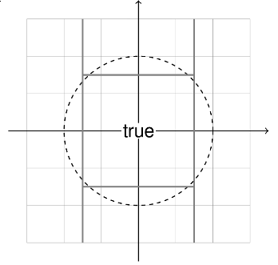
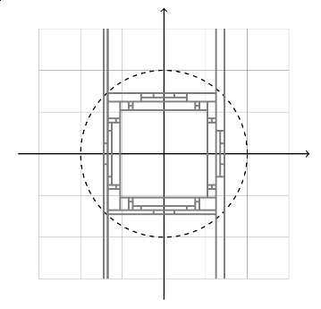
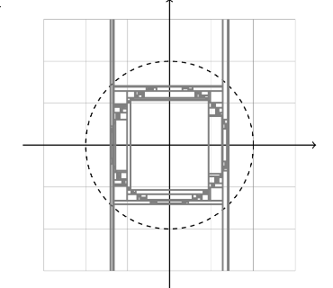

% 資工系的有趣事

# 傳教時間

## ~~傳教時間~~

## 資工系的有趣事

# 資料結構與演算法

## 資料結構

* link list
* tree

## 演算法

* 排序 $N$ 個數字需要比較 $N^2$？
* $N \log_2{N}$
* $1000^2 \approx 1000000$ v.s. $1000 \times \log_2{1000} \approx 9965$
* 最短路徑

# 自然語言處理

## N-Gram

* $P(w_2 | w_1) = \frac{P(w_1, w_2)}{P(w_1)}$

## Colocation

* 常一起出現的字 $\implies$ 出現機率不獨立

## PMI

* $\log{\frac{P(x, y)}{P(x)P(y)}}$

## Term Project

```
10      5       你們說呢 EMOTICON
11      18      看吧.要跟我一樣.悠哉悠哉的小跑步才行ㄡ EMOTICON
12      4       要當一隻帥狗也不是那麼容意的 EMOTICON
13      5       我要每天玩.每天咬.咬到我跑不動的那一天為止 EMOTICON
14      12      今天開始要加班了~媽ㄉ~剝奪我晚上聊天打屁的樂趣! EMOTICON
15      8       昨天~其實根本不在家~害姐姐跟co妮卡等到2點~真是不好意思! EMOTICON
16      7       第二天則到了龍蟠大草原,雖然熱的要死,但風景也是美到無話可說,且還意外的看到 牛 一家人出來散步,真是HAPPY!!而下午,則到了南灣海灘,玩了沙灘排球和沙雕,且也一身濕, EMOTICON  到了晚上,我們到了悠活大飯店,玩盡了許多設施,粉HAPPY的!!對了,我們還去逛了墾丁的夜市,看到了猛男秀,吃了許多奇怪的東西ex:印度拉茶ˋ炸鮮奶等,還吃了土耳其冰淇淋,還被老闆耍了老半天,真是超級令我印象深刻的!!
17      17      獻給全天下為人父、為人子女的!!很感人喔!!真的想掉眼淚了!! EMOTICON
18      35      好懂事的小孩！ EMOTICON
19      32      後來，我吃ㄌ三哥、　芒果布丁　則是買ㄌ車站旁邊那家　　好吃好吃　流○水　 EMOTICON
```

[結果](https://docs.google.com/spreadsheets/d/1OKNOwilIt41GxWliR8t0PzEBjIIid4lfei7Jyy3UCfk/edit#gid=0)

## HMM

* Markov Model：馬可夫模型。
* 可能性：給你模型，算這個模型輸出 $o_1, o_2, \cdots$ 的機率
* 解碼：給你模型，找這個模型輸出 $o_1, o_2, \cdots$ 時最有可能的狀態 $s_1, s_2, \cdots$
* 訓練：給你一堆觀察到的輸出 $o_1, o_2, \cdots$，找出最有可能的模型。

## Word Vector

[Online Demo](http://deeplearner.fz-qqq.net/)

# 機率

## 中央極限定理

## Chi-Square Test

## TF-IDF

對於某個字 w 在文件 d 的重要性：

$$\text{tf} = \frac{ \text{w 在 d 裡出現的次數} }{ \text{文件的字數} }$$
$$\text{idf} = \frac{ \text{文件的個數} }{ \text{包含 w 的文件個數} }$$

$\text{tf-idf} = \text{tf} \times \text{idf}$


# 機器學習

## 機器學習

* [sklearn](http://scikit-learn.org/stable/index.html) 
* [More](http://www.csie.ntu.edu.tw/~htlin/mooc/)
  * [Free Youtube Video](https://www.youtube.com/playlist?list=PLXVfgk9fNX2I7tB6oIINGBmW50rrmFTqf)
    
## Classifier

## [Decision Tree](http://www.csie.ntu.edu.tw/~htlin/mooc/doc/209_present.pdf#page=102)





## Cluster


以上圖片來自 [sklearn](http://scikit-learn.org/stable/index.html) 官方網站文件

## [SVM](http://work.caltech.edu/slides/slides15.pdf)

## Neuron Network

* SoftMax: $\text{softmax}(x)_i = \frac{\exp(x_i)}{\sum_j \exp(x_j)}$
* [MNIST](https://www.tensorflow.org/versions/r0.9/tutorials/mnist/beginners/index.html)
* [More](http://neuralnetworksanddeeplearning.com/index.html)

# 計算機概論

## 計算機概論

* From Nand to Tetris
* [More](http://www.nand2tetris.org/course.php)

> Saad Nasser built our Hack computer when he was 11 years old

